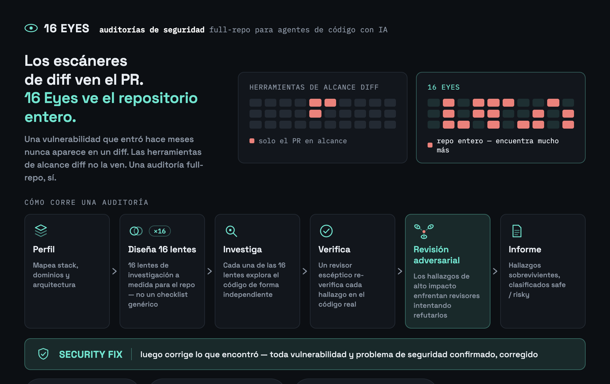

# 16 Eyes

**Auditorías de seguridad impulsadas por IA para [Claude Code](https://claude.com/claude-code),
[Gemini CLI](https://geminicli.com/), [Cursor](https://cursor.com/) y
[GitHub Copilot](https://github.com/features/copilot) — todo el repositorio o
limitadas a diff/PR.**




> Dieciséis ojos independientes revisan cada hallazgo antes de que llegue a tu informe:
> la lente que lo encontró, un verificador escéptico que relee el código real, y — para
> los hallazgos de alto impacto — varios revisores adversariales que intentan
> activamente refutarlo. **Nada llega al informe solo por la palabra de un agente.**


<sub>[Video en calidad completa en YouTube](https://www.youtube.com/watch?v=tdKqpVFLX_4)</sub>

*[Read in English](./README.md) · [Leia em português](./README.pt-BR.md)*

## Por qué existe

Las herramientas limitadas al diff (el `/security-review` nativo de Claude Code, la
mayoría de los escáneres conectados al CI) hacen una sola pasada sobre lo que cambió y
solo ven el PR/rama actual. `/16-eyes audit-diff` también está limitado al diff, pero
ejecuta las lentes a medida del repo, verifica cada hallazgo de forma escéptica y hace
revisión adversarial de los de alto impacto — un pipeline más pesado y escéptico que un
revisor de una sola pasada, y una buena opción para integrar en CI. `/16-eyes audit` va
más allá: escanea **todo el repositorio**, sin importar qué cambió recientemente — una
vulnerabilidad que lleva meses intacta en el código es invisible para cualquier
herramienta limitada al diff, `audit-diff` incluido. Es un barrido profundo, deliberado
y ocasional, no algo para ejecutar en cada commit.

A diferencia de una lista de verificación fija, 16 Eyes **primero perfila tu
repositorio** (stack, dominios, arquitectura) y luego **diseña su propio plan de
investigación** — un servicio pequeño recibe un puñado de lentes a medida, un backend
grande y multi-dominio recibe muchas más — y en ambos casos las lentes tratan sobre lo
que *realmente existe* en tu código, no una lista genérica.

## Instalación

**Claude Code**, como plugin — el camino más rápido, sin necesitar npm/Node:

```
/plugin marketplace add kigiela/16-eyes
/plugin install 16-eyes@16-eyes
```

**Cualquiera de las cuatro herramientas**, vía npm:

```bash
npx 16-eyes install
```

Instala el skill de Claude Code globalmente en `~/.claude/skills/user/16-eyes`. Usa
`--project` para instalarlo en `.claude/skills/16-eyes` del repositorio actual en su
lugar. Se necesita una sesión nueva de Claude Code después — los skills se descubren al
inicio de la sesión, no a mitad de ella.

```bash
npx 16-eyes update       # vuelve a copiar la última versión
npx 16-eyes uninstall    # elimina lo que se instaló (nunca toca el .16-eyes/ propio de un repo)
npx 16-eyes status       # muestra qué está instalado, y dónde, en cada herramienta
```

Para Gemini CLI, Cursor o GitHub Copilot (en lugar de, o además de, Claude Code), pasa
`--target`:

```bash
npx 16-eyes install --target gemini    # → .gemini/commands + .gemini/agents
npx 16-eyes install --target cursor    # → .cursor/skills + .cursor/agents
npx 16-eyes install --target copilot   # → .github/agents + .github/prompts
npx 16-eyes install --target all       # todas las herramientas de una vez
```

Estos son siempre relativos al proyecto (haz `git add` y commit de ellos) — ninguna de
estas herramientas tiene el concepto de skill global de Claude Code. Ver
[Otras herramientas](#otras-herramientas) más abajo para lo que cambia en ellas.

## Uso

Dentro de Claude Code, en cualquier repositorio:

```
/16-eyes init         configura — detecta gates/exclusiones/salida, diseña las lentes
/16-eyes audit        ejecuta todas las lentes en todo el repositorio
/16-eyes audit-diff   el mismo motor, limitado a un diff/PR
/16-eyes fix          aplica los hallazgos — los safe directamente, los risky con tu confirmación
```

`init` diseña y persiste las lentes de investigación del repo — `audit` y `audit-diff`
las reutilizan en vez de rediseñarlas desde cero en cada ejecución. Si lo omites,
cualquiera de los dos comandos hace el bootstrap automáticamente (sin preguntas, seguro
en CI); ejecútalo explícitamente antes si quieres personalizar patrones de exclusión,
ubicación de salida, profundidad o idioma antes de que eso ocurra. `audit` es de solo
lectura y puede tardar unos minutos (decenas de llamadas a subagentes) — es lo esperado
para un barrido de todo el repositorio; `audit-diff` es mucho más barato por estar
limitado a un diff. `fix` nunca hace commit ni push; siempre deja los cambios en tu
working tree para que los revises.

## Cómo funciona

1. **Perfil y diseño de lentes** (`/16-eyes init`, una vez) — un agente explora la
   estructura del repo e identifica su stack, dominio, y los subsistemas específicos que
   importan para la seguridad (pagos, webhooks, auth, subida de archivos, uso de LLM, lo
   que realmente aplique); un segundo agente, dado ese perfil, diseña una lista de
   lentes de investigación a medida — omitiendo categorías que no aplican, añadiendo las
   específicas del repo que sí aplican. Persistido en `.16-eyes/lenses.json`.
2. **Lentes → verificación** (`audit`/`audit-diff`, en cada ejecución) — cada lente
   persistida investiga de forma independiente (en todo el repo, o limitada a un diff);
   cada hallazgo que plantea recibe una re-verificación escéptica independiente contra
   el código real (no solo la descripción del propio hallazgo).
3. **Revisión adversarial** — los hallazgos clasificados como de alto impacto pasan por
   una segunda ronda independiente: varios revisores intentan, cada uno, *refutar* el
   hallazgo. Solo sobrevive si la mayoría no logra refutarlo.
4. **Informe** — los hallazgos que sobreviven se clasifican como `safe` (corrección
   mecánica, sin cambio de comportamiento) o `risky` (requiere decisión humana),
   escritos tanto en un informe markdown (`SECURITY_AUDIT_<fecha>.md` o
   `SECURITY_AUDIT_DIFF_<fecha>.md`) como en un complemento legible por máquina
   (`.json`, consumido por `/16-eyes fix`).

## Otras herramientas

Gemini CLI, Cursor y GitHub Copilot tienen cada uno su propio adaptador ligero en
[`integrations/`](./integrations) (instalado vía `--target`, ver arriba), todos
compartiendo el mismo `.16-eyes/config.json` / `.16-eyes/lenses.json` / informes que
Claude Code — ejecuta `init` una vez con cualquiera de las herramientas y todas las
demás instaladas lo reutilizan. La sintaxis de invocación cambia según la convención de
cada herramienta:

| | init | audit | audit-diff | fix |
|---|---|---|---|---|
| Claude Code | `/16-eyes init` | `/16-eyes audit` | `/16-eyes audit-diff` | `/16-eyes fix` |
| Gemini CLI | `/16-eyes:init` | `/16-eyes:audit` | `/16-eyes:audit-diff` | `/16-eyes:fix` |
| Cursor | `16-eyes-init` | `16-eyes-audit` | `16-eyes-audit-diff` | `16-eyes-fix` |
| GitHub Copilot | `@16-eyes-init` | `@16-eyes-audit` | `@16-eyes-audit-diff` | `@16-eyes-fix` |

<details>
<summary><strong>Salvedad honesta sobre los adaptadores fuera de Claude Code</strong></summary>

La herramienta `Workflow` de Claude Code ejecuta un pipeline escrito por el agente con
llamadas validadas por JSON-schema — las etapas de fan-out, verificación y revisión
adversarial se imponen de verdad, no solo se sugieren. Al momento de escribir esto,
Gemini CLI, Cursor y Copilot tienen subagentes paralelos, pero ninguno tiene esa
capacidad de imponer un schema — sus adaptadores le piden a cada agente delegado que
devuelva un bloque JSON y hacen el parsing ellos mismos, con las mismas protecciones de
corrupción/refutación escritas como instrucciones explícitas en vez de código impuesto.
Es la misma metodología, con garantías un poco más débiles que la versión de Claude
Code. El coding agent asíncrono de GitHub Copilot en particular no tiene ningún
equivalente a slash-command — depende de `AGENTS.md` (también instalado por
`--target copilot`) para tener un mínimo de contexto, en vez de un comando dedicado.

</details>

## CI

`/16-eyes audit-diff` está pensado para ejecutarse en cada PR. Configuración más
simple, como una GitHub Action publicada:

```yaml
- uses: kigiela/16-eyes@v1
  with:
    anthropic_api_key: ${{ secrets.ANTHROPIC_API_KEY }}
```

Ver [`docs/ci.md`](./docs/ci.md) para el panorama completo (solo comentario por
defecto, bloqueo de merge opcional, y la alternativa con el workflow crudo si quieres
ver cada paso explícitamente).

## Licencia

MIT — ver [LICENSE](./LICENSE). También: [Política de Privacidad](./docs/privacy-policy.md) ·
[Términos de Servicio](./docs/terms-of-service.md) ·
[Divulgaciones de seguridad y transparencia](./docs/security-and-safety.md).
