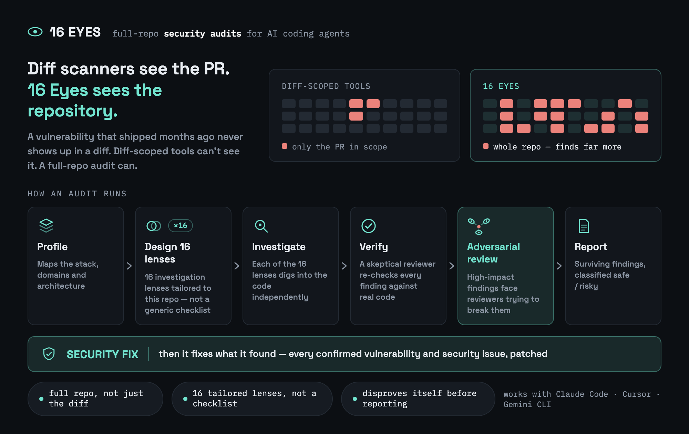

# 16 Eyes

**AI-driven security audits for [Claude Code](https://claude.com/claude-code),
[Gemini CLI](https://geminicli.com/), [Cursor](https://cursor.com/), and
[GitHub Copilot](https://github.com/features/copilot) — full-repo or diff/PR-scoped.**




> Sixteen independent eyes look at every finding before it reaches your report: the lens
> that found it, a skeptical verifier that re-reads the real code, and — for high-impact
> findings — several adversarial reviewers actively trying to disprove it. **Nothing
> reaches the report on one agent's word alone.**


<sub>[Full-quality video](./assets/demo-en.mp4)</sub>

*[Leia em português](./README.pt-BR.md) · [Lee en español](./README.es.md)*

## Why this exists

Diff-scoped tools (Claude Code's built-in `/security-review`, most CI-wired scanners)
do a single pass over what changed and only see the current PR/branch. `/16-eyes
audit-diff` is diff-scoped too, but runs the repo's own tailored lenses, verifies every
finding skeptically, and adversarially re-checks high-impact ones — a heavier, more
skeptical pipeline than a single-pass reviewer, and a good fit for wiring into CI.
`/16-eyes audit` goes further: it scans the **whole repository**, regardless of recent
changes — a vulnerability that's been sitting untouched in the codebase for months is
invisible to any diff-scoped tool, `audit-diff` included. It's a deliberate, occasional
deep sweep, not something you run on every commit.

Unlike a fixed checklist, 16 Eyes **profiles your repo first** (stack, domains,
architecture) and then **designs its own investigation plan** — a small service gets a
handful of tailored lenses, a large multi-domain backend gets many more, and either way
the lenses are about what's actually *in your codebase*, not a generic list.

## Install

**Claude Code**, as a plugin — the quickest path, no npm/Node needed:

```
/plugin marketplace add kigiela/16-eyes
/plugin install 16-eyes@16-eyes
```

**Any of the four tools**, via npm:

```bash
npx 16-eyes install
```

Installs the Claude Code skill globally to `~/.claude/skills/user/16-eyes`. Use
`--project` to install into the current repository's `.claude/skills/16-eyes` instead. A
brand-new Claude Code session is needed afterward — skills are discovered at session
start, not picked up mid-session.

```bash
npx 16-eyes update       # re-copy the latest version
npx 16-eyes uninstall    # remove what was installed (never touches a repo's own .16-eyes/ data)
npx 16-eyes status       # show what's installed, and where, across every tool
```

For Gemini CLI, Cursor, or GitHub Copilot instead (or in addition), pass `--target`:

```bash
npx 16-eyes install --target gemini    # → .gemini/commands + .gemini/agents
npx 16-eyes install --target cursor    # → .cursor/skills + .cursor/agents
npx 16-eyes install --target copilot   # → .github/agents + .github/prompts
npx 16-eyes install --target all       # every tool above, in one shot
```

These are always project-relative (`git add` and commit them) — none of these tools
share Claude Code's global-skills concept. See [Other tools](#other-tools) below for
what's different about them.

## Use

Inside Claude Code, in any repository:

```
/16-eyes init         configure — detect gates/excludes/output, design the lenses
/16-eyes audit        run every lens across the whole repo
/16-eyes audit-diff   the same engine, scoped to a diff/PR instead
/16-eyes fix          apply the findings — safe ones directly, risky ones with your OK
```

`init` designs and persists the repo's investigation lenses — `audit` and `audit-diff`
both reuse them instead of redesigning from scratch every run. Skip it and either
command bootstraps it automatically the first time (no questions asked, safe in CI);
run it explicitly first if you want to customize exclude patterns, output location,
depth, or language before that happens. `audit` is read-only and can take a few minutes
(dozens of subagent calls) — expected for a full-repo sweep; `audit-diff` is much
cheaper since it's scoped to a diff. `fix` never commits or pushes; it always leaves
changes in your working tree for you to review.

## How it works

1. **Profile & lens design** (`/16-eyes init`, once) — one agent explores the repo's
   structure and identifies its stack, domain, and the specific subsystems that matter
   for security (payments, webhooks, auth, file uploads, LLM usage, whatever actually
   applies); a second agent, given that profile, designs a tailored list of
   investigation lenses — skipping categories that don't apply, adding repo-specific
   ones that do. Persisted to `.16-eyes/lenses.json`.
2. **Lenses → verification** (`audit`/`audit-diff`, every run) — each persisted lens
   investigates independently (across the whole repo, or scoped to a diff); every
   finding it raises gets an independent skeptical re-check against the real code (not
   just the finding's own description).
3. **Adversarial review** — findings classified as high-impact get a second,
   independent pass: several reviewers each try hard to *disprove* the finding. It only
   survives if a majority fail to refute it.
4. **Report** — the surviving findings are classified `safe` (mechanical fix, no
   behavior change) or `risky` (needs a human decision), written as both a markdown
   report (`SECURITY_AUDIT_<date>.md` or `SECURITY_AUDIT_DIFF_<date>.md`) and a
   machine-readable companion (`.json`, consumed by `/16-eyes fix`).

## Other tools

Gemini CLI, Cursor, and GitHub Copilot each get their own thin adapter under
[`integrations/`](./integrations) (installed via `--target`, see above), all sharing the
same `.16-eyes/config.json` / `.16-eyes/lenses.json` / reports as Claude Code — run
`init` once with any one tool and every other installed tool reuses it. Invocation
syntax differs per tool's own convention:

| | init | audit | audit-diff | fix |
|---|---|---|---|---|
| Claude Code | `/16-eyes init` | `/16-eyes audit` | `/16-eyes audit-diff` | `/16-eyes fix` |
| Gemini CLI | `/16-eyes:init` | `/16-eyes:audit` | `/16-eyes:audit-diff` | `/16-eyes:fix` |
| Cursor | `16-eyes-init` | `16-eyes-audit` | `16-eyes-audit-diff` | `16-eyes-fix` |
| GitHub Copilot | `@16-eyes-init` | `@16-eyes-audit` | `@16-eyes-audit-diff` | `@16-eyes-fix` |

<details>
<summary><strong>Honest caveat about the non–Claude Code adapters</strong></summary>

Claude Code's `Workflow` tool lets it run a script-authored pipeline with
JSON-schema-validated agent calls — the fan-out, verify, and adversarial-review stages
are hard-enforced, not just prompted. As of this writing, Gemini CLI, Cursor, and
Copilot all have parallel subagents, but none has that schema-enforcement primitive —
their adapters ask each delegated agent to return a fenced JSON block and parse it, with
the same corruption/refutation guards written as explicit instructions instead of
enforced code. It's the same methodology, with slightly weaker guarantees than the
Claude Code version. GitHub Copilot's async coding agent specifically has no
slash-command equivalent at all — it relies on `AGENTS.md` (also installed by
`--target copilot`) for baseline awareness instead of a dedicated command.

</details>

## CI

`/16-eyes audit-diff` is designed to run on every PR — see [`docs/ci.md`](./docs/ci.md)
for the recommended GitHub Actions setup (official `claude-code-action`, comment-only by
default, opt-in merge gating).

## License

MIT — see [LICENSE](./LICENSE).
