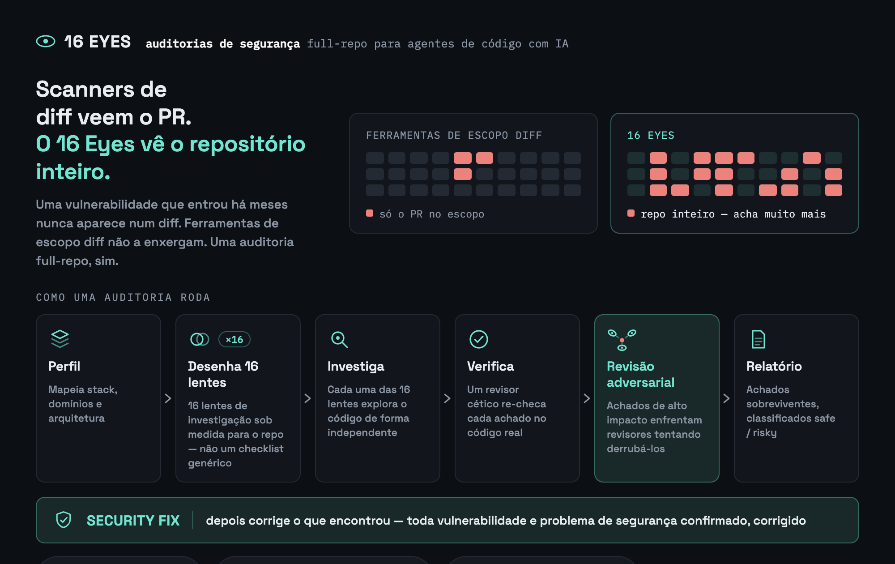

# 16 Eyes

**Auditorias de segurança orientadas por IA para [Claude Code](https://claude.com/claude-code),
[Gemini CLI](https://geminicli.com/), [Cursor](https://cursor.com/) e
[GitHub Copilot](https://github.com/features/copilot) — repositório inteiro ou
escopado a diff/PR.**




> Dezesseis olhos independentes olham cada achado antes dele chegar no seu relatório: a
> lente que o encontrou, um verificador cético que relê o código de verdade, e — pros
> achados de impacto alto — vários revisores adversariais tentando ativamente derrubar o
> achado. **Nada entra no relatório só na palavra de um agente.**


<sub>[Vídeo em qualidade completa no YouTube](https://www.youtube.com/watch?v=Dkodk7A7q-k)</sub>

*[Read in English](./README.md) · [Lee en español](./README.es.md)*

## Por que isso existe

Ferramentas escopadas a diff (o `/security-review` nativo do Claude Code, a maioria dos
scanners ligados no CI) fazem uma única passada sobre o que mudou e só enxergam o
PR/branch atual. O `/16-eyes audit-diff` também é escopado a diff, mas roda as lentes
sob medida do repo, verifica cada achado ceticamente e faz revisão adversarial dos de
impacto alto — um pipeline mais pesado e cético que um revisor de passada única, e uma
boa opção pra plugar no CI. O `/16-eyes audit` vai além: varre o **repositório inteiro**,
independente do que mudou recentemente — uma vulnerabilidade parada no código há meses é
invisível pra qualquer ferramenta escopada a diff, `audit-diff` incluído. É um sweep
profundo, deliberado e ocasional, não algo pra rodar a cada commit.

Diferente de uma checklist fixa, o 16 Eyes **perfila seu repo primeiro** (stack,
domínios, arquitetura) e só então **desenha o próprio plano de investigação** — um
serviço pequeno ganha um punhado de lentes sob medida, um backend grande e
multi-domínio ganha bem mais — e em ambos os casos as lentes são sobre o que
*realmente existe* no seu código, não uma lista genérica.

## Instalação

**Claude Code**, como plugin — o caminho mais rápido, sem precisar de npm/Node:

```
/plugin marketplace add kigiela/16-eyes
/plugin install 16-eyes@16-eyes
```

**Qualquer uma das quatro ferramentas**, via npm:

```bash
npx 16-eyes install
```

Instala o skill do Claude Code globalmente em `~/.claude/skills/user/16-eyes`. Use
`--project` pra instalar no `.claude/skills/16-eyes` do repositório atual em vez disso.
Uma sessão nova do Claude Code é necessária depois — skills são descobertos no início da
sessão, não no meio dela.

```bash
npx 16-eyes update       # recopia a versão mais recente
npx 16-eyes uninstall    # remove o que foi instalado (nunca toca no .16-eyes/ próprio de um repo)
npx 16-eyes status       # mostra o que está instalado, e onde, em cada ferramenta
```

Pra Gemini CLI, Cursor ou GitHub Copilot (em vez de, ou além do Claude Code), passe
`--target`:

```bash
npx 16-eyes install --target gemini    # → .gemini/commands + .gemini/agents
npx 16-eyes install --target cursor    # → .cursor/skills + .cursor/agents
npx 16-eyes install --target copilot   # → .github/agents + .github/prompts
npx 16-eyes install --target all       # todas as ferramentas de uma vez
```

Esses são sempre relativos ao projeto (dê `git add` e commit neles) — nenhuma dessas
ferramentas tem o conceito de skill global do Claude Code. Veja
[Outras ferramentas](#outras-ferramentas) abaixo pra saber o que muda nelas.

## Uso

Dentro do Claude Code, em qualquer repositório:

```
/16-eyes init         configura — detecta gates/exclusões/saída, desenha as lentes
/16-eyes audit        roda todas as lentes no repositório inteiro
/16-eyes audit-diff   o mesmo motor, escopado a um diff/PR
/16-eyes fix          aplica os achados — os safe direto, os risky com sua confirmação
```

`init` desenha e persiste as lentes de investigação do repo — `audit` e `audit-diff`
reaproveitam em vez de redesenhar do zero a cada execução. Se pular, qualquer um dos
dois faz o bootstrap automático (sem perguntas, seguro em CI); rode explicitamente
antes se quiser customizar padrões de exclusão, local de saída, profundidade ou idioma
antes disso acontecer. `audit` é somente leitura e pode levar alguns minutos (dezenas de
chamadas de subagente) — esperado pra um sweep do repositório inteiro; `audit-diff` é
bem mais barato por ser escopado a um diff. `fix` nunca commita nem dá push; sempre
deixa as mudanças na working tree pra você revisar.

## Como funciona

1. **Perfil e desenho de lentes** (`/16-eyes init`, uma vez) — um agente explora a
   estrutura do repo e identifica a stack, o domínio, e os subsistemas específicos que
   importam pra segurança (pagamentos, webhooks, auth, upload de arquivo, uso de LLM, o
   que realmente se aplicar); um segundo agente, dado esse perfil, desenha uma lista de
   lentes de investigação sob medida — pulando categorias que não se aplicam,
   adicionando as específicas do repo que se aplicam. Persistido em
   `.16-eyes/lenses.json`.
2. **Lentes → verificação** (`audit`/`audit-diff`, a cada execução) — cada lente
   persistida investiga de forma independente (no repo inteiro, ou escopada a um diff);
   todo achado que ela levanta passa por uma reverificação cética independente contra o
   código de verdade (não só a descrição do próprio achado).
3. **Revisão adversarial** — achados classificados como impacto alto passam por uma
   segunda rodada independente: vários revisores tentam, cada um, *derrubar* o achado.
   Só sobrevive se a maioria não conseguir refutar.
4. **Relatório** — os achados que sobrevivem são classificados `safe` (correção
   mecânica, sem mudança de comportamento) ou `risky` (precisa de decisão humana),
   escritos tanto como relatório markdown (`SECURITY_AUDIT_<data>.md` ou
   `SECURITY_AUDIT_DIFF_<data>.md`) quanto um companheiro legível por máquina (`.json`,
   consumido pelo `/16-eyes fix`).

## Outras ferramentas

Gemini CLI, Cursor e GitHub Copilot têm cada um seu próprio adaptador enxuto em
[`integrations/`](./integrations) (instalado via `--target`, veja acima), todos
compartilhando o mesmo `.16-eyes/config.json` / `.16-eyes/lenses.json` / relatórios que o
Claude Code — rode `init` uma vez com qualquer uma das ferramentas e todas as outras
instaladas reaproveitam. A sintaxe de invocação muda conforme a convenção de cada
ferramenta:

| | init | audit | audit-diff | fix |
|---|---|---|---|---|
| Claude Code | `/16-eyes init` | `/16-eyes audit` | `/16-eyes audit-diff` | `/16-eyes fix` |
| Gemini CLI | `/16-eyes:init` | `/16-eyes:audit` | `/16-eyes:audit-diff` | `/16-eyes:fix` |
| Cursor | `16-eyes-init` | `16-eyes-audit` | `16-eyes-audit-diff` | `16-eyes-fix` |
| GitHub Copilot | `@16-eyes-init` | `@16-eyes-audit` | `@16-eyes-audit-diff` | `@16-eyes-fix` |

<details>
<summary><strong>Ressalva honesta sobre os adaptadores fora do Claude Code</strong></summary>

A ferramenta `Workflow` do Claude Code roda um pipeline escrito-por-agente com chamadas
validadas por JSON-schema — as etapas de fan-out, verificação e revisão adversarial são
impostas de fato, não só sugeridas. No momento desta escrita, Gemini CLI, Cursor e
Copilot têm subagentes paralelos, mas nenhum tem essa capacidade de impor schema — os
adaptadores deles pedem pra cada agente delegado retornar um bloco JSON e fazem o
parsing, com as mesmas travas de corrupção/refutação escritas como instruções explícitas
em vez de código imposto. É a mesma metodologia, com garantias um pouco mais fracas que
a versão Claude Code. O coding agent assíncrono do GitHub Copilot especificamente não
tem equivalente a slash-command nenhum — ele depende do `AGENTS.md` (também instalado
por `--target copilot`) pra ter um mínimo de contexto, em vez de um comando dedicado.

</details>

## CI

`/16-eyes audit-diff` foi feito pra rodar em toda PR — veja [`docs/ci.md`](./docs/ci.md)
pra configuração recomendada de GitHub Actions (`claude-code-action` oficial, só
comentário por padrão, bloqueio de merge opcional).

## Licença

MIT — ver [LICENSE](./LICENSE).
